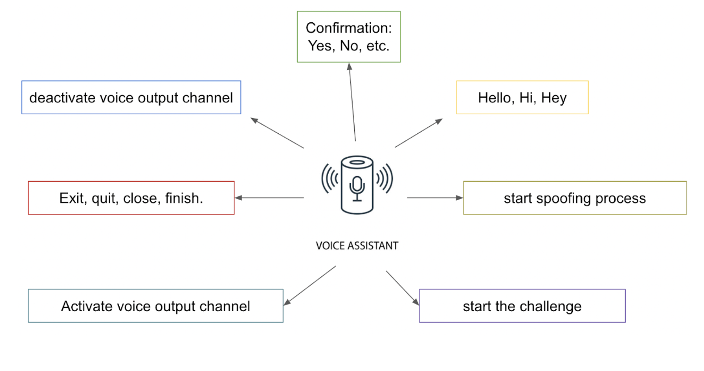
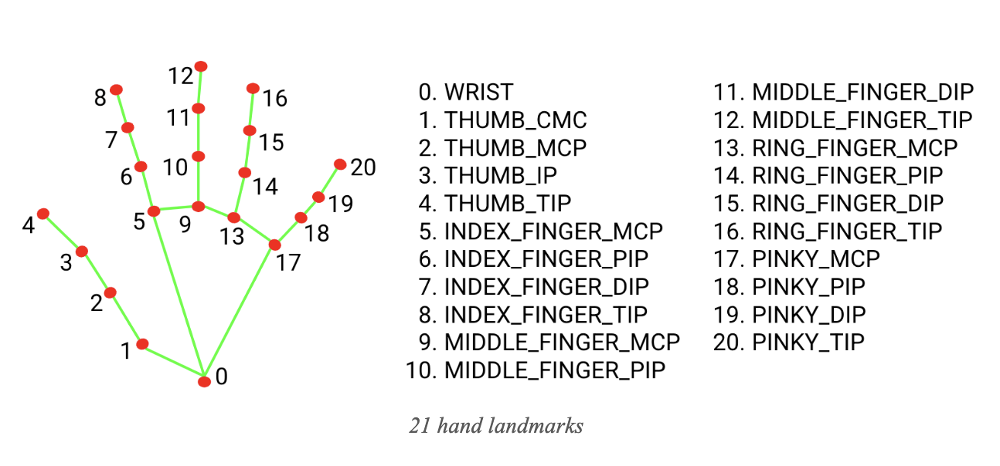
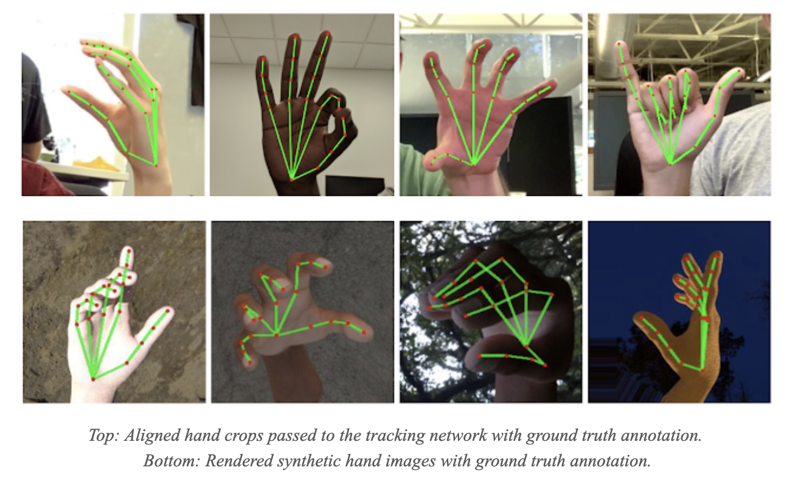

# Multimodal-fatcha

## What is the Task?
* Multimodal interfaces are a class of intelligent multimedia systems that make use of multiple and natural means of communication (modalities), such as speech, handwriting, gestures, and gaze, to support human-machine interaction. More specifically, the term modality describes human perception as one of the three following perception channels: visual, auditive, and tactile. Multimodality qualifies interactions that comprise more than one modality either the input (from the human to the machine)or the output (from the machine to the human) and the use of more than one device on either side (e.g., microphone, camera, display, keyboard, mouse, pen, trackball, data glove)

The goal in this project is to have an application that is able to simulate the CAPTCHA functionalities with the use of multichannel interactions by considering different channels of the interaction in order to detect whether the system is communicating with a human or machine.    

  

## Prerequisites:
Since the application is based on a Multimodal Interaction (3 different channels voice, visual, and gesture), the user should be able to meet some requirements such as a microphone, camera, display, keyboard, mouse, and speaker.
- Python 3.10.5
- [OpenCV3](https://opencv.org/)
- tensorflow
- keras
- scikit-image
- Pandas
- Numpy
- mediapipe
- azure.cognitiveservices.speech
# Multimodality
*  Speech, gestures, and graphics interaction have been considered in order to support human-machine interaction. The term modality describes human perception as one of the three channels: visual, auditive, and tactile.
These channels have been taken into account to proceed with the communication. As mentioned in the introduction, Multimodality qualifies interactions with more than one modality either the input or the output. We know that Mulimodality entails the use of more than one device on either side.
## Multimodality: Input Devices
### Keyboard
  

### Microphone
To be able to use the microphone and listen to the speech that comes to the system, Microsoft Cognitive Services | Speech service has used in the project.

  
To use the speechesdk you need to create a virtual resource on the cloud base Azure. Azure provides us with a specific credential to work with the resources. The credentials are stored in the config file in the project.  Speechsdk sends the captured voice to the virtual machine in the cloud, processes it, and returns the result. During the process of speech recognition by the virtual machine, the execution of the project in our device is stopped for a moment. In the following, you can see our virtual machine.  

  

The list of the command that can be performed by the microphone by the use of speechsdk is visualized in the figure below.

  
### Camera  
Camera is used to present different kinds of input to the systems. The frame of the faces and hands are taken by the camera and processed during the interaction. The confirmation command has been used as a complementarity message in order to complete the process.
During the interaction using this device, facial expressions, gestural actions, and head pose detection have been considered for the application.
  

## Multimodality: Output Devices
For the case of output devices, in order to be able to interact with the user or machine, we can rely on the laptop default display as the main resource of graphical information. during the interaction from devices to the human side, different emoji icons used for the case of gestural interaction, and corresponding text representation to increase the flexibility of the system.
Even in output interaction (from system to human) we have taken to best practices. One was to think that we are somehow interacting with a person that is not able to read (no qualification), in this case, we thought that showing an emoji of the corresponding gestures would be good feedback from the system to the mentioned person in order to increase the understanding.
And second, we decided to support another kind of disability which is visual cases. In this way, the voice output interaction according to the system’s speaker would be an ideal device to communicate with those people. Again we take into account the Microsoft speech synthesizer to synthesize the given text for better interaction with the people.
Many feedbacks either textual or graphical have been used during the interaction to increase the understanding of communication flow.
We have used redundancy as one of the coordination modalities to interact with the user.

## Challenge-Response
The user/machine must enter into a new section which is called challenge-response Fatcha. In this stage like the previous one, users should respond to some of the challenges generated entirely at random based on different human nature actions.
All challenges are combined into 3 different challenges:
- Head pose (keeping the head up, down, right, left)
- Gesture Recognition (illustrating victory, like, dislike, perfect, etc shapes with hands)
- Emotion Recognition (pretending some demanded emotions e,g, happy, angry, surprised, etc)

Each of the mentioned functionalities requires a specific kind of implementation, then we need to process them and inject them into a challenge-response loop. Each of the users has 3 chances in total to try to be recognized as a human otherwise they will be rejected by the system.
Design choices here are the following:
- In general, the user is allowed to make mistakes 3 times in total!. In other words, each user can attempt to be recognized 3 times. (this number is manageable)
- When the challenge started, a subset of the total challenges are selected for the upcoming challenge process at random (the number of the questions is manageable)
- Each question has a limited time to be completed, there is a timer for all the questions.
- To successfully pass a specific question, you need to present the requested action for 25 continuous frames. (the `detected` feedback is shown to help the user the current state of detection)
- To successfully pass the challenge, you need to pass all the questions correctly.

### Head Pose
MediaPipe Face Mesh is a solution that estimates 468 3D face landmarks in real-time even on mobile devices. It employs machine learning (ML) to infer the 3D facial surface, requiring only a single camera input without the need for a dedicated depth sensor. Utilizing lightweight model architectures together with GPU acceleration throughout the pipeline, the solution delivers real-time performance-critical for live experiences.

To estimate the head pose a statistical function has been defined according to the 6 important landmarks that were extracted from the total landmarks in faceless.
To deepen the concept check the documentation folder.

### Gesture Recognition
Another challenge will be generated based on the user gesture. Similar to the Head Pose, this kind of challenge has been implemented by the MediaPipe Hands library.
The hand's landmarks model performs precise keypoint localization of 21 3D hand-knuckle coordinates inside the detected hand regions via regression, that is direct coordinate prediction. The model learns a consistent internal hand pose representation and is robust even to partially visible hands and self-occlusions.  

In the following figures that are taken from the original resource of Mediapipe, you can see detailed information about the 21 landmark points and their ground truth annotations information.

  
  

Having access to the hand landmarks was just the first step of our approach. We thought that the distance between the landmarks for each gesture can somehow represent a specific kind of pattern. All the landmarks while presenting those gestures have been gathered and trained in order to predict each of the gestures.
 
The first step, as mentioned above was to create a custom dataset of the landmarks. A module has implemented to accessed the camera and ask you to present a kind of gesture and start recording the landmarks to create the dataset.
