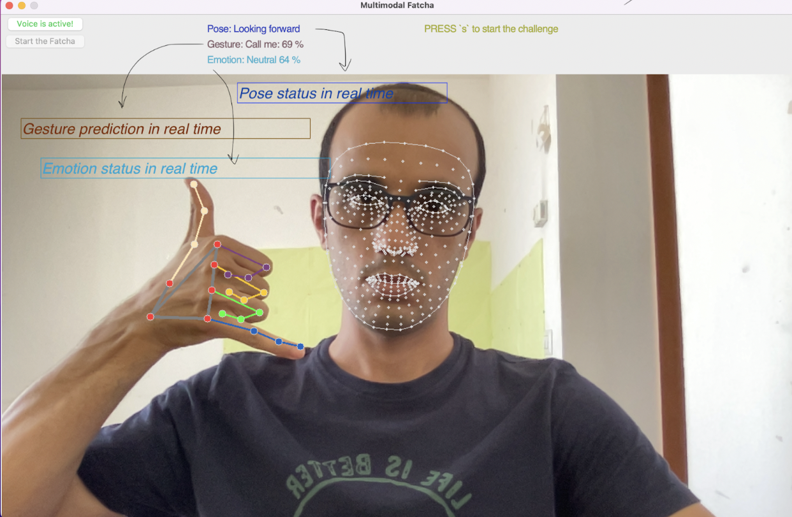
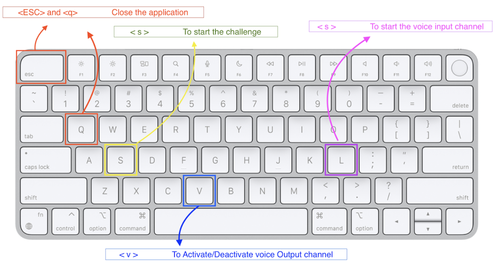
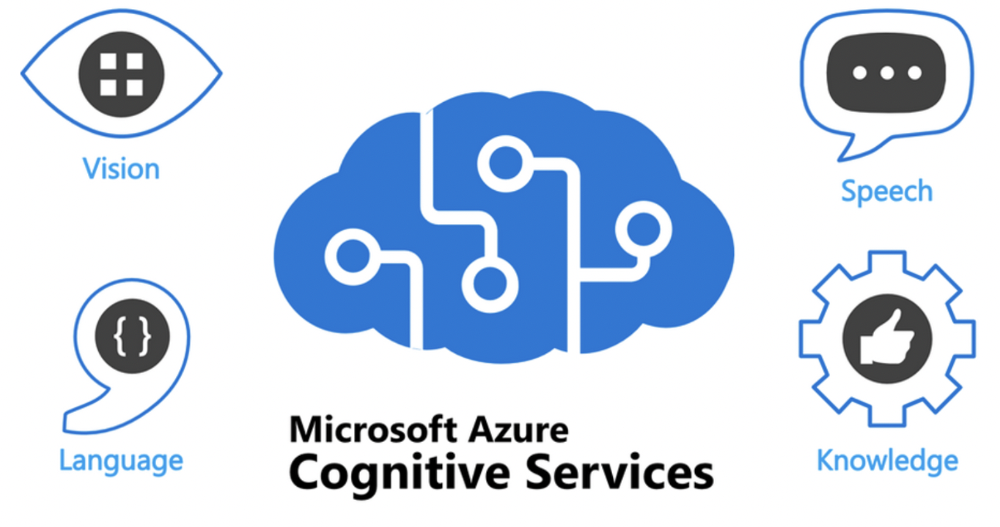
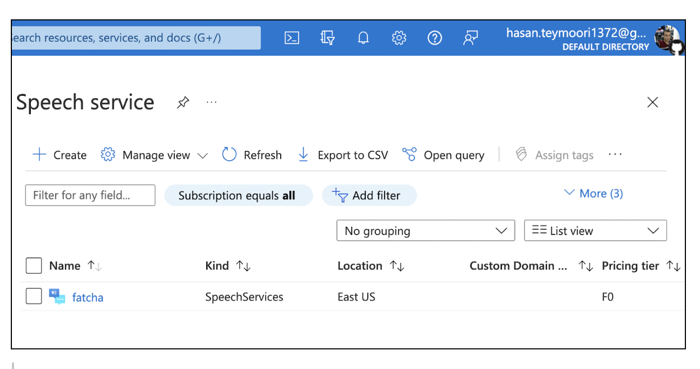
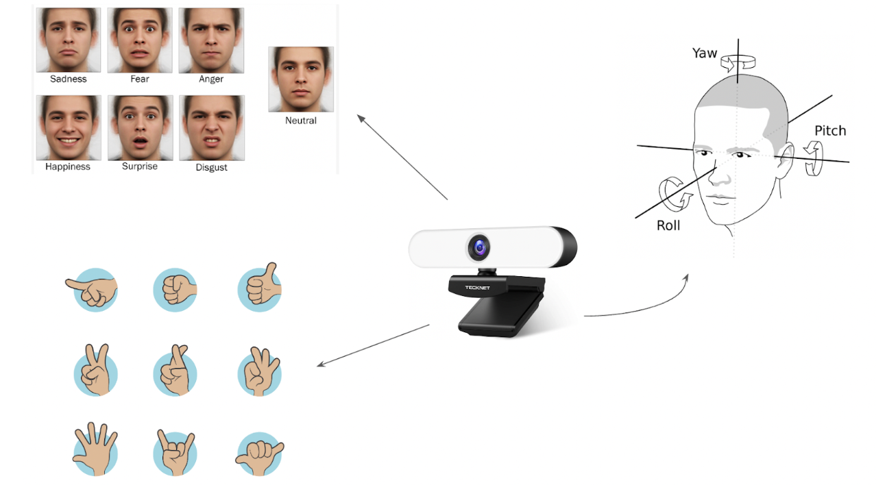

# multimodal-fatcha

# What is the Task?
* Multimodal interfaces are a class of intelligent multimedia systems that make use of multiple and natural means of communication (modalities), such as speech, handwriting, gestures, and gaze, to support human-machine interaction. More specifically, the term modality describes human perception as one of the three following perception channels: visual, auditive, and tactile. Multimodality qualifies interactions that comprise more than one modality either the input (from the human to the machine)or the output (from the machine to the human) and the use of more than one device on either side (e.g., microphone, camera, display, keyboard, mouse, pen, trackball, data glove)
 
The goal in this project is to have an application that is able to simulate the CAPTCHA functionalities with the use of multichannel interactions by considering different channels of the interaction in order to detect whether the system is communicating with a human or machine.

*   

## Prerequisites:
Since the application is based on a Multimodal Interaction (3 different channels voice, visual, and gesture), the user should be able to meet some requirements such as a microphone, camera, display, keyboard, mouse, and speaker.
- Python 3.10.5
- [OpenCV3](https://opencv.org/)
- tensorflow
- keras
- scikit-image
- Pandas
- Numpy
- mediapipe
- azure.cognitiveservices.speech
# Multimodality
*  Speech, gestures, and graphics interaction have been considered in order to support human-machine interaction. The term modality describes human perception as one of the three channels: visual, auditive, and tactile.
These channels have been taken into account to proceed with the communication. As mentioned in the introduction, Multimodality qualifies interactions with more than one modality either the input or the output. We know that Mulimodality entails the use of more than one device on either side.
## Multimodality: Input Devices
- Keyboard
*   
---
- Microphone
To be able to use the microphone and listen to the speech that comes to the system, Microsoft Cognitive Services | Speech service has used in the project.
*   
To use the speechesdk you need to create a virtual resource on the cloud base Azure. Azure provides us with a specific credential to work with the resources. The credentials are stored in the config file in the project.  Speechsdk sends the captured voice to the virtual machine in the cloud, processes it, and returns the result. During the process of speech recognition by the virtual machine, the execution of the project in our device is stopped for a moment. In the following, you can see our virtual machine.
*   

The list of the command that can be performed by the microphone by the use of speechsdk is visualized in the figure below.
*   
---
- Camera
Camera is used to present different kinds of input to the systems. The frame of the faces and hands are taken by the camera and processed during the interaction. The confirmation command has been used as a complementarity message in order to complete the process.
During the interaction using this device, facial expressions, gestural actions, and head pose detection have been considered for the application.
*   
